<!-- Only one placeholder left: replace rakshitagarwal (your GitHub username) in the stats + snake image URLs -->

 

 

  

---

## `> cat about.txt`

Full-Stack Software Engineer with **3+ years** shipping scalable SaaS products across **EHS/ESG, fintech, healthcare, events and real-time auctions**. I like systems that stay fast under load: event-driven microservices, clean APIs, and interfaces people actually enjoy using. Lately I'm wiring **LLMs (Gemini, Claude)** into products so they do the boring work for users.

🌐 Portfolio: **[rakshit-five.vercel.app](https://rakshit-five.vercel.app/)** · 💼 LinkedIn: **[/in/rakshitagarwal](https://www.linkedin.com/in/rakshitagarwal/)**

---

## `> ./stack --animated`

 
 

---

## `> git log --career`

<table>
<tr>
<td width="140"><b>2025 → Now</b></td>
<td>
<b>Software Engineer · Brainerhub Solutions</b> Ahmedabad 
🌐 <b>Enterprise EHS/ESG SaaS</b>: 15+ production features · 20+ enterprise tenants · 5,000+ MAU 
⚙️ 6 NestJS microservices behind an API Gateway → <b>30% lower latency</b>, zero-downtime deploys 
📡 NATS streaming for <b>50,000+ events/day</b> → 40% less inter-service coupling 
💳 <b>Fintech SaaS</b>: 1,200+ clients · $2M+/month · 99% uptime · Gemini AI automates 70% of routine insights · Stripe subscriptions with Canadian GST/HST across 9 provinces 
<code>NestJS</code> <code>Next.js</code> <code>MongoDB</code> <code>Neo4j</code> <code>NATS</code> <code>MySQL</code> <code>Stripe</code> <code>Gemini</code> <code>AWS</code> <code>GCP</code>
</td>
</tr>
<tr>
<td><b>Dec 2024 – Apr 2025</b></td>
<td>
<b>Web Developer · Yudiz Solutions</b> 
🎟️ Event platform: 50+ concurrent events · 3,000+ attendees · <b>$45K+ revenue in 3 months</b> 
⚡ QR ticketing with real-time validation: check-in <b>45s → under 8s</b>, 90% fewer errors 
<code>Next.js</code> <code>React</code> <code>Tailwind</code> <code>Stripe</code>
</td>
</tr>
<tr>
<td><b>Apr – Nov 2024</b></td>
<td>
<b>Software Engineer · ArsenalTech</b> 
🏥 Healthcare portal: 1,000+ patients · 30+ clinics · WCAG 2.1 AA 
📈 Onboarding drop-off cut by 20% · consultation bookings <b>+40%</b> 
🧩 Redux Toolkit layer with 15+ hooks → 55% fewer frontend defects 
<code>React</code> <code>Next.js</code> <code>Redux Toolkit</code> <code>Tailwind</code>
</td>
</tr>
<tr>
<td><b>Feb 2023 – Mar 2024</b></td>
<td>
<b>Software Engineer · Globalvox</b> 
🔨 Real-time auctions: 2,000+ concurrent users · 100+ rooms · <b>200ms bid response</b> 
🔒 15,000+ bids/hour with 100% consistency (PostgreSQL transactions + Redis distributed locks) 
🚀 Socket.IO + Redis → 70% lower latency vs REST 
<code>Node.js</code> <code>Express</code> <code>Socket.IO</code> <code>Redis</code> <code>PostgreSQL</code> <code>Docker</code>
</td>
</tr>
</table>

---

## `> ./snake --eat-contributions`

---

## `> ./stats --live`

---

## `> cat now.md`

- 🔭 Building AI-powered SaaS features on top of Gemini and Claude
- 🧠 Completing **Data Science with Python** (Coursera, 2026)
- ☕ Completed **Java Enterprise with DevOps** (NIIT, 2025)
- 🎯 Practising on [LeetCode](https://leetcode.com/u/rakshitag13) · [HackerRank](https://hackerrank.com/Rakshit17) · [CodeChef](https://codechef.com/rakshit310)
- 💬 Ask me about: **NestJS microservices, NATS/event-driven design, Stripe billing, real-time systems**

 

